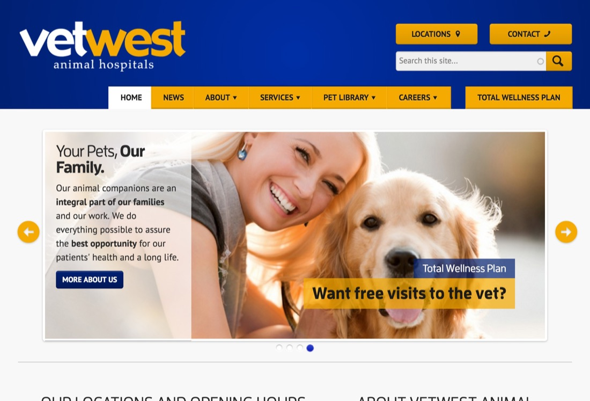
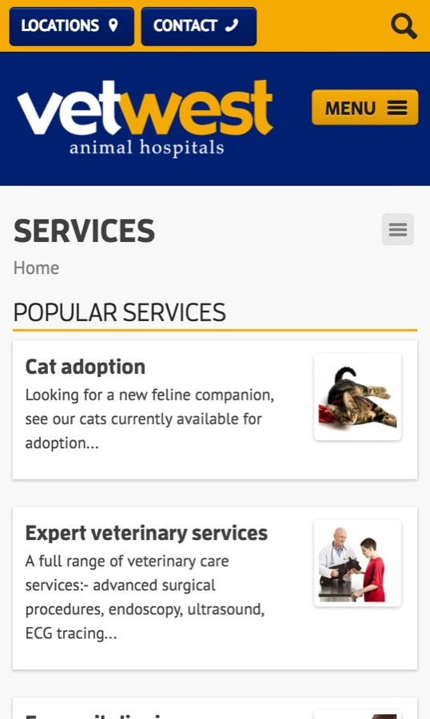
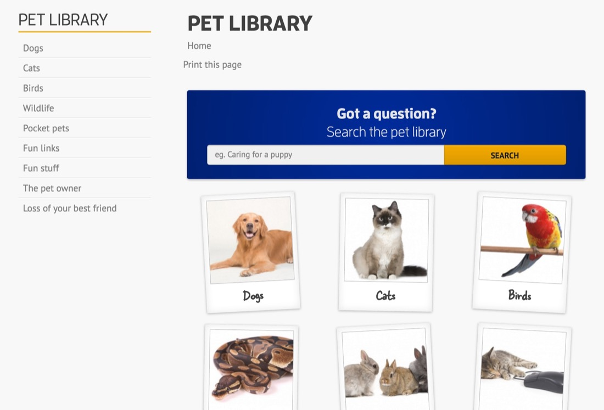
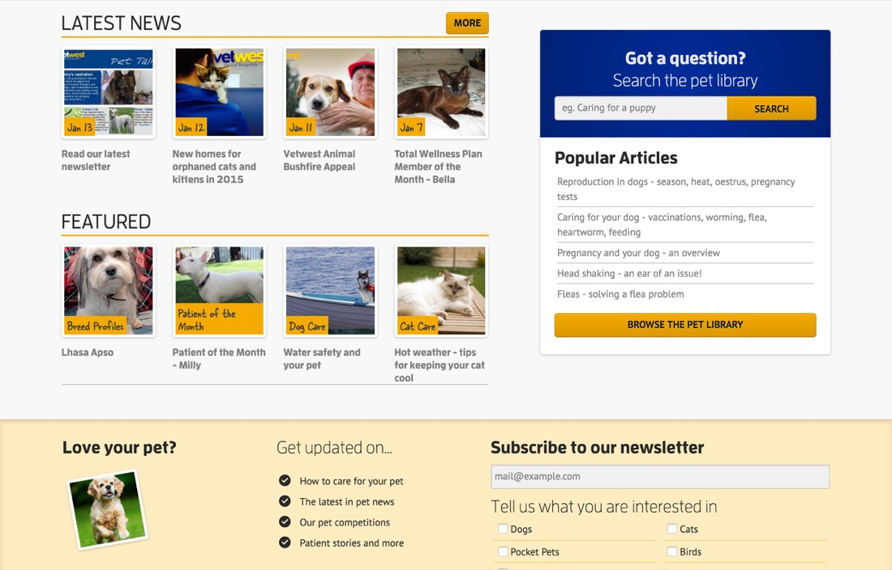

This project involved coming up with a completely new IA and making thousands of articles easily accessible. It was a fairly early responsive website and I utilised style tiles, wireframes and a pattern library.

